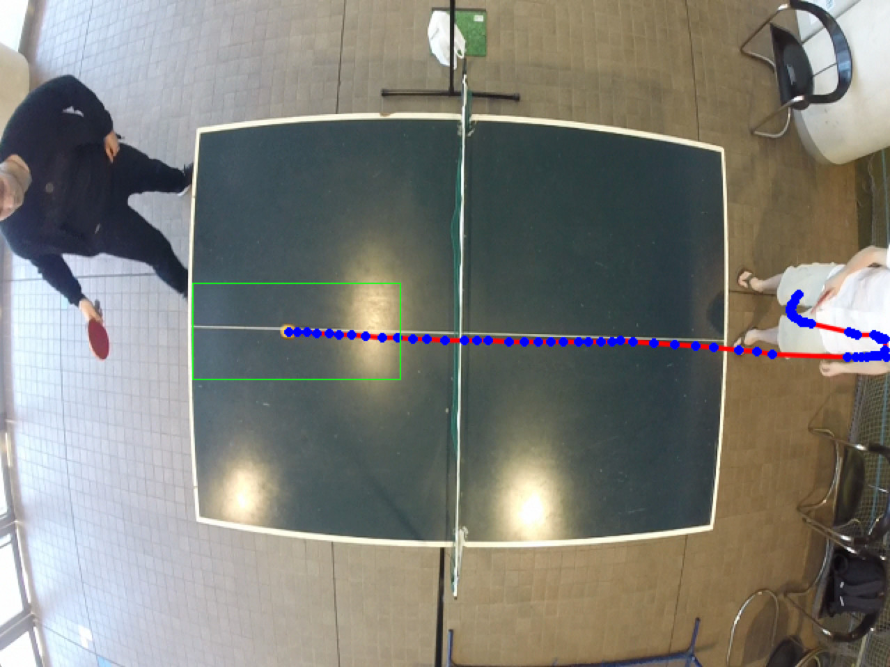

Description
===========
The goal of the project is to apply computer vision with [OpenCV](http://opencv.org/), and maybe depth sensors like Kinect, to keep track of the score at table tennis. Furthermore, data analysis can be made to infer statistics about the players.


Installation
============

OpenCV 2.4
----------

### Mac OS X

```
brew tap homebrew/science && brew install opencv
```

The OpenCV is usually installed in `/usr/local/Cellar/opencv/`.

To use the Python bindings, you must create symlinks in the directory where Python is installed, usually in `/Library/Python/2.7/site-packages/`, pointing to the OpenCV directory.

```
sudo ln -s /usr/local/Cellar/opencv/2.4.11/lib/python2.7/site-packages/cv.py /Library/Python/2.7/site-packages/cv.py
sudo ln -s /usr/local/Cellar/opencv/2.4.11/lib/python2.7/site-packages/cv2.so /Library/Python/2.7/site-packages/cv2.so
```


Advancement
===========

1. First step: [camera calibration](camera_calibration)
2. Second step: [distortion correction](distortion_correction)
3. Third step: [table lines detection](table_lines_detection)
4. Fourth step: [ball tracking](ball_tracking)
5. Fifth step: [3D position calculation with stereovision](stereovision)
    1. [calibration](stereovision/calibration)


[Distortion correction](distortion_correction)
----------------------------------------------

| Before  | After |
| ------------- | ------------- |
|   |   |


[Table lines detection](table_lines_detection)
----------------------------------------------

| Hough transform | Rectangle detection | Hough after k-mean |
| --------------- | ------------------- | ------------------ |
|  |  |  |


[Ball tracking](ball_tracking)
------------------------------


