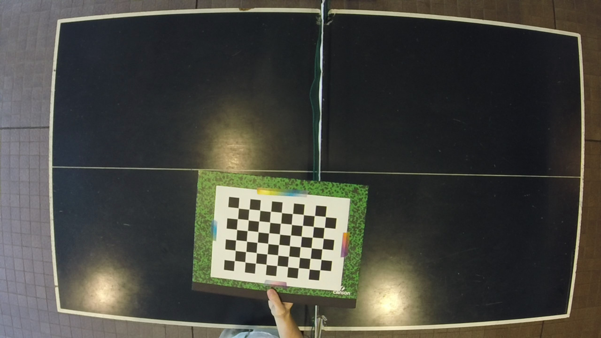
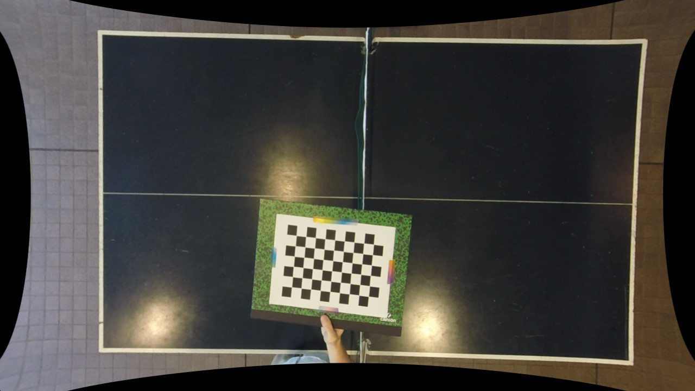

Description
-----------
Example program to read a video file, undistort the stream, and display it.

Program arguments:

1. Video filename
2. XML calibration settings filename

Example: GoPro Hero 3+ medium mode
----------------------------------

### Before

### After

