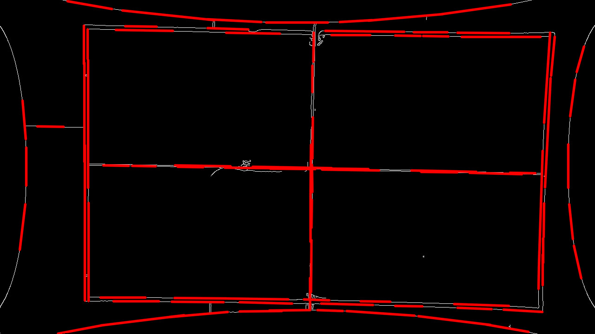
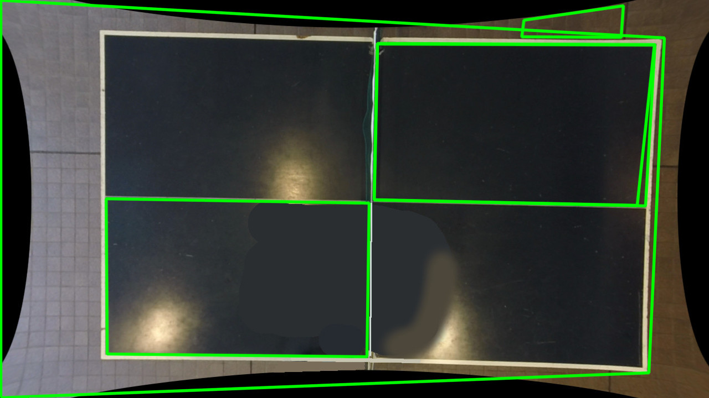
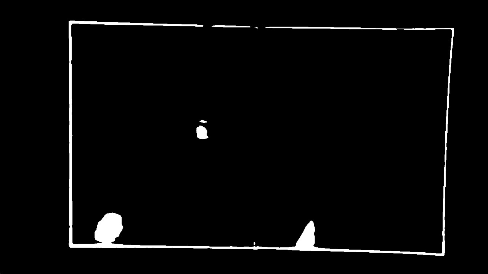
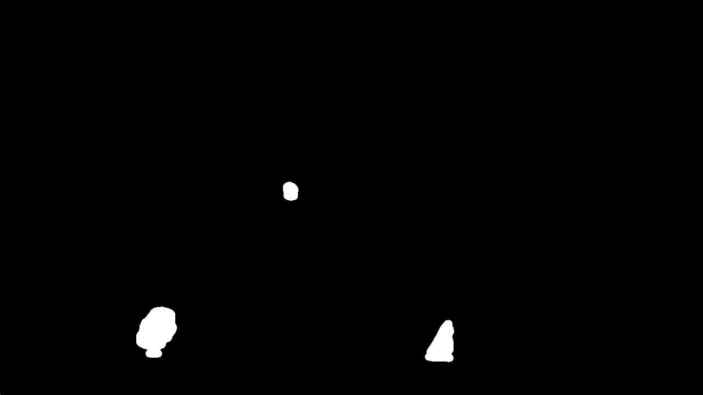
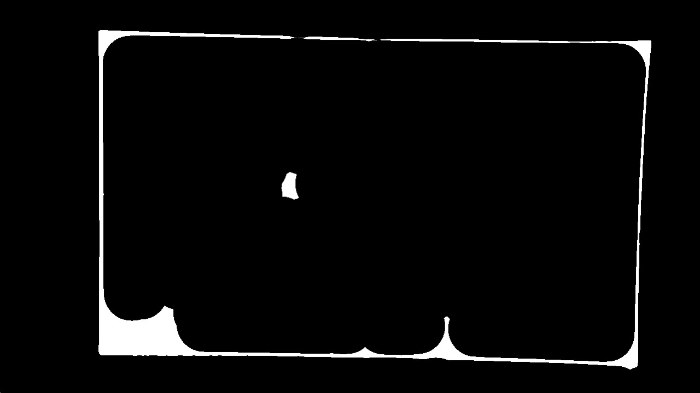
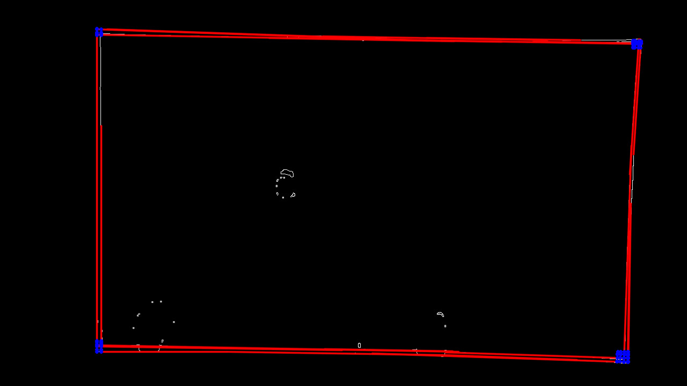
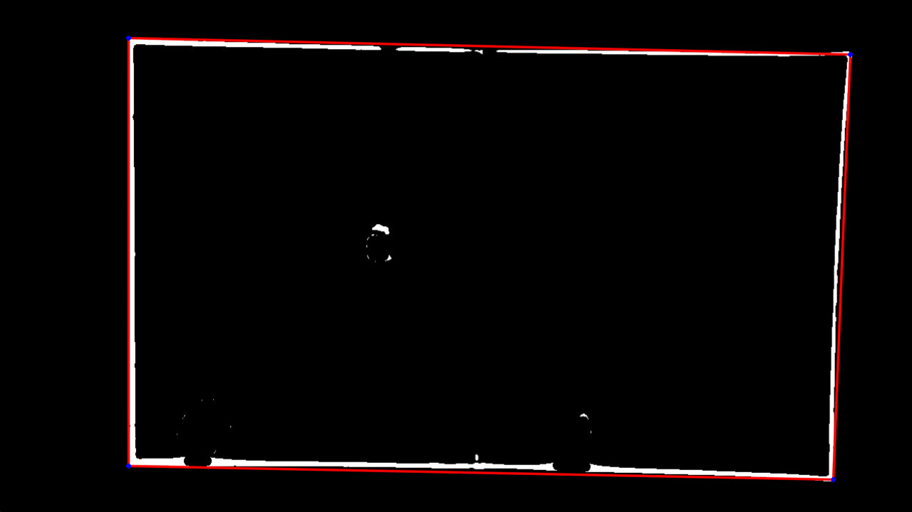

Description
===========
Example programs to detect the lines of the edges of the table on a picture.

First attempt
-------------
Using [Hough transform](http://docs.opencv.org/doc/tutorials/imgproc/imgtrans/hough_lines/hough_lines.html).

Second attempt
--------------
Using [rectangle detection](https://opencv-code.com/tutorials/detecting-simple-shapes-in-an-image/).

k-mean
------
We can see on the above pictures that some other lines are detected whereas we don't want them to be, so we apply the k-mean algorithm (with k = 4) to segment the image in 4 parts:

* the table (which color we know: either green or blue)
* the table lines (white)
* the ground
* the black edges of the pictures, which come from undistortion algorithm (always black)

Then, we binarize the picture: the pixels belonging to the k-mean class corresponding to the table lines are set to white, and the pixels of the 3 other classes are set to black.

We apply then a few [morphological operations](http://docs.opencv.org/doc/tutorials/imgproc/opening_closing_hats/opening_closing_hats.html). First, an opening to find the big blobs in the image.

Then, we substract the opening from the binarized image, to remove all big blobs and keep only the lines of the table.

Then, we can apply a closing to join the lines of the table and fill gaps, but it may make some blobs appear again.

Hough transform on binarized image
----------------------------------

### Step 1

We apply the Hough transform after a Canny edge detection. This gave me about 20 line segments.

We classify all lines in four categories:

* the horizontal lines in the upper part
* the horizontal lines in the lower part
* the vertical lines at the left
* the vertical lines at the right

### Step 2

With some math, we can compute all the line intersections around each corner in the table.

### Step 3

So we have a lot of candidates for each corner of the table. The corner we select as the coordinate of the real corner of the table is the farther corner from the center of the table.

** WARNING ** : this algorithm suppose that the anti-distortion filter was successful and effective. If there is some [barrel distortion](http://en.wikipedia.org/wiki/File:Barrel_distortion.svg) on the input picture, this algorithm will give false corner coordinates that are farther from the center of the table than the actual real corners.

